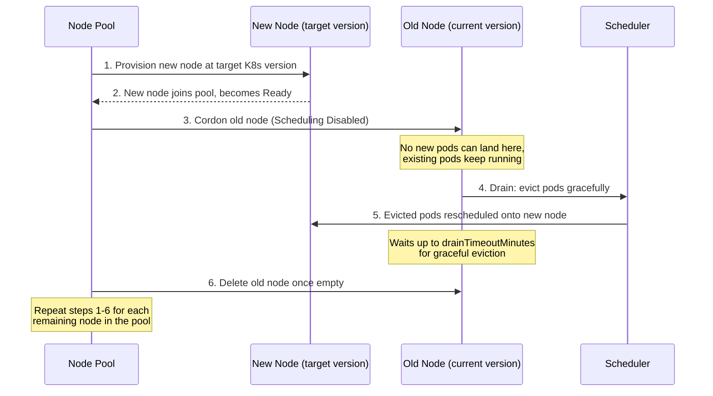

# AKS Pipelines

Two standalone GitHub Actions workflows for AKS — portable, no dependency
on any other pipeline or repo. Drop both into `.github/workflows/` of any
project that needs them.

| File | Purpose |
|---|---|
| `upgrade-aks.yml` | Two-stage approval upgrade (control plane, then worker nodes) |
| `aks-cluster-info.yml` | Read-only diagnostic snapshot of a cluster |

---

## Creating an AKS cluster (CLI)

If you don't already have a test cluster, this creates one on an older
Kubernetes version deliberately, so the upgrade pipeline actually has
something to upgrade to:

```bash
az login

# Resource group
az group create --name migration-rg --location eastus

# See what versions are actually available in your region before picking one
az aks get-versions --location eastus -o table

# Create the cluster one or two minor versions behind the latest
az aks create \
  --resource-group migration-rg \
  --name migration-cluster \
  --location eastus \
  --kubernetes-version 1.34.1 \
  --node-count 2 \
  --node-vm-size Standard_DS2_v2 \
  --generate-ssh-keys \
  --enable-oidc-issuer \
  --enable-workload-identity
```

A few notes on the flags:

- **`--enable-oidc-issuer` / `--enable-workload-identity`** — these enable
  the *cluster's own* workload identity features (letting pods inside the
  cluster assume Azure identities). This is a **separate concept** from the
  GitHub Actions OIDC federation covered below — don't confuse the two. You
  don't strictly need these flags just to run the upgrade/info pipelines,
  but they're good practice to enable up front if you'll eventually run
  workloads that need Azure permissions.
- **`--kubernetes-version`** — pick something behind the latest available
  (check via `az aks get-versions`) so you have a real upgrade path to test
  against. If you create a cluster already on the newest version, the
  `plan` job will correctly report `hasUpgrade=false` and there's nothing
  to exercise.

**Verify it's ready:**
```bash
az aks show --resource-group migration-rg --name migration-cluster \
  --query "{PowerState:powerState.code, ProvisioningState:provisioningState, Version:kubernetesVersion}" \
  -o table
```

**Delete when done testing** (AKS clusters cost money while running):
```bash
az aks delete --resource-group migration-rg --name migration-cluster --yes --no-wait
az group delete --name migration-rg --yes --no-wait
```

---

## Why `az ad app federated-credential` is required (detailed)

This is the single most common source of failures when setting these
pipelines up, so it's worth understanding properly rather than treating it
as a copy-paste incantation.

### The problem OIDC federation solves

The old way to let a CI/CD pipeline authenticate to Azure was to create a
**service principal with a client secret** (a password), store that
password as a GitHub secret, and have the pipeline send it to Azure on
every run. This works, but it's a real liability:

- The secret is a **long-lived, bearer credential** — anyone who obtains it
  (a leaked log, a compromised dependency, a misconfigured permission) can
  authenticate as that identity from anywhere, indefinitely, until someone
  notices and rotates it.
- It has to be **manually rotated** periodically, and every rotation is a
  chance to break the pipeline if you forget to update it everywhere it's
  used.
- Azure has no way to verify the secret is *actually* being presented by
  your GitHub Actions run specifically — a stolen secret works identically
  whether it's used by your pipeline or by an attacker.

**OpenID Connect (OIDC) federation removes the stored secret entirely.**
Instead of a password, GitHub's Actions runner generates a **short-lived,
cryptographically signed token** at the moment your workflow runs, describing
*exactly* which repo, branch, and (optionally) environment triggered it.
Azure AD checks that signed token against a **federated credential** you
configured in advance, and if it matches, issues a short-lived access token
for that run only. Nothing is stored anywhere — a leaked log from a past run
is useless to an attacker, because the token in it has already expired and
can't be replayed.

### What a federated credential actually is

When you run:

```bash
az ad app federated-credential create --id "$APP_ID" --parameters '{
  "name": "gh-env-aks-upgrade-control-plane",
  "issuer": "https://token.actions.githubusercontent.com",
  "subject": "repo:mridulsingh8390/githubaction-pipeline:environment:aks-upgrade-control-plane",
  "audiences": ["api://AzureADTokenExchange"]
}'
```

you're telling Azure AD: *"Trust tokens issued by GitHub's OIDC provider
(`issuer`), but only if the token's `subject` claim exactly matches this
string, and only if the token's `audience` matches `api://AzureADTokenExchange`."*
This is a narrow, explicit allowlist entry — not a blanket "trust GitHub"
statement. Each federated credential trusts exactly **one** subject string.

### The `subject` claim is the entire mechanism — and the exact thing that broke your run

This is what caused the `AADSTS700213` error you hit twice while setting
this up. GitHub embeds a `subject` claim into the token that describes
*where the workflow run came from*, using one of two formats:

| Trigger context | Subject format | Example |
|---|---|---|
| A job with **no** `environment:` block | `repo:OWNER/REPO:ref:refs/heads/BRANCH` | `repo:mridulsingh8390/githubaction-pipeline:ref:refs/heads/main` |
| A job **with** an `environment:` block | `repo:OWNER/REPO:environment:ENV_NAME` | `repo:mridulsingh8390/githubaction-pipeline:environment:aks-upgrade-control-plane` |

The `plan` and `post-upgrade-validation` jobs in `upgrade-aks.yml` have no
`environment:` block, so they authenticate using the **branch** subject.
The `upgrade-control-plane` and `upgrade-worker-nodes` jobs each have their
own `environment:` block (that's what creates the two separate manual
approval gates), so they authenticate using the **environment** subject —
and critically, **the environment name in the subject string must be
character-for-character identical** to the `environment: name:` value in
the workflow YAML.

This is exactly what went wrong in your setup: the workflow file said
`environment: name: dev` at one point, then later `environment: name:
aks-upgrade-control-plane` — and each time, a federated credential existed
for a *different* name than the one the running workflow actually used.
Azure AD doesn't do fuzzy matching or fallback — if the exact subject
string isn't in the allowlist, the login is rejected with `AADSTS700213`,
full stop. There's no way to "trust the app in general" without also
listing every specific subject it's allowed to authenticate as.

### Why you need multiple federated credentials, not just one

Because `plan`/`post-upgrade-validation` use the branch subject and
`upgrade-control-plane`/`upgrade-worker-nodes` each use their own
environment subject, a single workflow file can require **up to three
different federated credentials** to fully succeed end-to-end:

```bash
# Covers plan + post-upgrade-validation (no environment: block)
az ad app federated-credential create --id "$APP_ID" --parameters '{
  "name": "gh-branch-main",
  "issuer": "https://token.actions.githubusercontent.com",
  "subject": "repo:mridulsingh8390/githubaction-pipeline:ref:refs/heads/main",
  "audiences": ["api://AzureADTokenExchange"]
}'

# Covers the upgrade-control-plane job specifically
az ad app federated-credential create --id "$APP_ID" --parameters '{
  "name": "gh-env-aks-upgrade-control-plane",
  "issuer": "https://token.actions.githubusercontent.com",
  "subject": "repo:mridulsingh8390/githubaction-pipeline:environment:aks-upgrade-control-plane",
  "audiences": ["api://AzureADTokenExchange"]
}'

# Covers the upgrade-worker-nodes job specifically
az ad app federated-credential create --id "$APP_ID" --parameters '{
  "name": "gh-env-aks-upgrade-worker-nodes",
  "issuer": "https://token.actions.githubusercontent.com",
  "subject": "repo:mridulsingh8390/githubaction-pipeline:environment:aks-upgrade-worker-nodes",
  "audiences": ["api://AzureADTokenExchange"]
}'
```

### Quick diagnostic command for next time

If you ever see `AADSTS700213` again, the fix is always the same
two-step process:

1. **Read the exact `subject claim` value from the failed run's logs** —
   it's printed right above the error, e.g.
   `subject claim - repo:OWNER/REPO:environment:SOME_NAME`.
2. **Check whether that exact string exists as a federated credential:**
   ```bash
   az ad app federated-credential list --id "$APP_ID" --query "[].{name:name, subject:subject}" --output table
   ```
   If it's missing, create it with that exact subject string — copy-pasted
   directly from the error, not retyped, to avoid a typo reintroducing the
   same problem.

---

## Prerequisites

### Secrets (repo → Settings → Secrets and variables → Actions)

| Secret | Value |
|---|---|
| `AZURE_CLIENT_ID` | App Registration client ID |
| `AZURE_TENANT_ID` | Azure AD tenant ID |
| `AZURE_SUBSCRIPTION_ID` | Target subscription ID |

Both pipelines share the same three secrets — set up once, use for both.

### GitHub Environments (repo → Settings → Environments)

Only `upgrade-aks.yml` needs these — `aks-cluster-info.yml` has no approval
gate since it's read-only:

- `aks-upgrade-control-plane`
- `aks-upgrade-worker-nodes`

Add required reviewers to each if you want the pipeline to actually pause
for approval (empty environments still work, they just won't block).
**The environment name here must exactly match both the `environment:
name:` value in the workflow YAML and the `subject` in its federated
credential** — see the detailed explanation above for why.

### One-time OIDC + role setup

```bash
APP_ID=$(az ad app create --display-name "github-actions-aks" --query appId -o tsv)
az ad sp create --id "$APP_ID"

TENANT_ID=$(az account show --query tenantId -o tsv)
SUBSCRIPTION_ID=$(az account show --query id -o tsv)

# Windows/Git Bash users: prefix this with MSYS_NO_PATHCONV=1, or the
# /subscriptions/... argument gets silently mangled into a Windows path
az role assignment create --assignee "$APP_ID" --role "Contributor" \
  --scope "/subscriptions/$SUBSCRIPTION_ID"

az ad app federated-credential create --id "$APP_ID" --parameters '{
  "name": "gh-branch-main",
  "issuer": "https://token.actions.githubusercontent.com",
  "subject": "repo:<owner>/<repo>:ref:refs/heads/main",
  "audiences": ["api://AzureADTokenExchange"]
}'

for ENV in aks-upgrade-control-plane aks-upgrade-worker-nodes; do
  az ad app federated-credential create --id "$APP_ID" --parameters "{
    \"name\": \"gh-env-${ENV}\",
    \"issuer\": \"https://token.actions.githubusercontent.com\",
    \"subject\": \"repo:<owner>/<repo>:environment:${ENV}\",
    \"audiences\": [\"api://AzureADTokenExchange\"]
  }"
done
```

---

## `upgrade-aks.yml`

### Flow

```
plan → upgrade-control-plane (approval) → upgrade-worker-nodes (approval) → post-upgrade-validation
```

- **`plan`**: validates the cluster is healthy, discovers current/available
  versions, runs a pre-upgrade node + PDB scan (surfaces drain-blocking PDBs
  *before* you approve anything), publishes a summary.
- **`upgrade-control-plane`**: optional pre-upgrade snapshot, then upgrades
  the control plane only.
- **`upgrade-worker-nodes`**: upgrades **system node pools first, then user
  node pools** (skipped entirely if `controlPlaneOnly=true`). See the
  dedicated section below for exactly how this works node-by-node.
- **`post-upgrade-validation`**: waits for nodes to be Ready, checks pod
  health, generates a full markdown report uploaded as a build artifact
  (retained 90 days).

### How the worker node upgrade actually works (surge upgrade)

AKS doesn't upgrade a node in place — it never touches the Kubernetes
version of a running node directly. Instead, for every node that needs
upgrading, it goes through a **replace, not modify** cycle:



Step by step, in the same order you'll see it in the Azure Portal's
**Node pools → Nodes** view:

1. **New node provisioned** — AKS creates a fresh VM already running the
   target Kubernetes version and joins it to the pool. `maxSurge` controls
   how many of these spin up in parallel (e.g. `33%` of pool size, or a
   flat number like `1`).
2. **New node ready** — appears in `kubectl get nodes` as `Ready`, but with
   zero pods yet (this is exactly what you saw as the `v1.35.1` node with
   growing pod count in your portal screenshot).
3. **Old node cordoned** — marked `Scheduling Disabled` in the portal /
   `SchedulingDisabled` in `kubectl`. It's still `Ready` and still running
   its existing pods — cordoning only blocks *new* pods from landing there,
   it doesn't evict anything by itself.
4. **Drain begins** — Kubernetes evicts pods off the cordoned node one at a
   time, respecting each pod's **Pod Disruption Budget** (this is exactly
   what the `plan` job's PDB scan checks for in advance — a PDB with
   `maxUnavailable: 0` can stall this step indefinitely). AKS waits up to
   `drainTimeoutMinutes` for graceful eviction before force-terminating
   whatever's left.
5. **Pods reschedule onto the new node** — the scheduler places evicted
   pods wherever capacity exists, typically the new node from step 1.
6. **Old node deleted** — once fully drained (pod count reaches zero), AKS
   removes the old VM entirely. It disappears from the node list.
7. **Repeat per node** — if the pool has more nodes than the surge count,
   this cycle repeats until every node is on the target version.
   `nodeSoakDurationMinutes` adds a pause after each node finishes before
   the next one starts, giving new nodes/pods time to settle before
   continuing.

This is why the upgrade is described as **zero-downtime** rather than
**zero-disruption** — individual pods do get evicted and rescheduled (a
real disruption to that pod), but the *service* stays available throughout
because pods move to already-Ready capacity before their old home is torn
down, rather than the whole pool going down and coming back up together.

### Inputs

| Input | Required | Default | Notes |
|---|---|---|---|
| `aksResourceGroup` | Yes | — | |
| `aksClusterName` | Yes | — | |
| `targetKubernetesVersion` | No | blank (auto-pick latest) | |
| `controlPlaneOnly` | No | `false` | |
| `nodePoolName` | No | blank (all pools) | |
| `maxSurge` | No | `33%` | |
| `drainTimeoutMinutes` | No | `30` | |
| `nodeSoakDurationMinutes` | No | `5` | Wait after each **node** upgrades before continuing — AKS supports this natively |
| `createSnapshot` | No | `true` | Non-fatal if the snapshot permission is missing |

## `aks-cluster-info.yml`

Read-only — no mutations, no approval gate. Fetches cluster info, node pool
details, and per-node version/OS/runtime info via `kubectl`.

| Input | Required |
|---|---|
| `aksResourceGroup` | Yes |
| `aksClusterName` | Yes |

---

## Troubleshooting

### `AADSTS700213: No matching federated identity record found`

See the detailed OIDC section above. Short version: the `subject claim`
printed in the failed step's logs doesn't match any federated credential
you've created. Copy that exact string and create a matching credential.

### Node stuck at "Scheduling Disabled" with pod count not decreasing

Usually a Pod Disruption Budget with `maxUnavailable: 0` blocking the
drain. Check with:
```bash
kubectl get pdb --all-namespaces
```
The `plan` job scans for this before you approve, but a PDB created *after*
that scan (but before the drain reaches it) won't be caught in advance.

### Snapshot step logs a warning and continues

Requires the `Microsoft.ContainerService/snapshots/write` permission in
addition to `Contributor`. Non-fatal by design — the upgrade still proceeds
without a snapshot if this permission is missing.