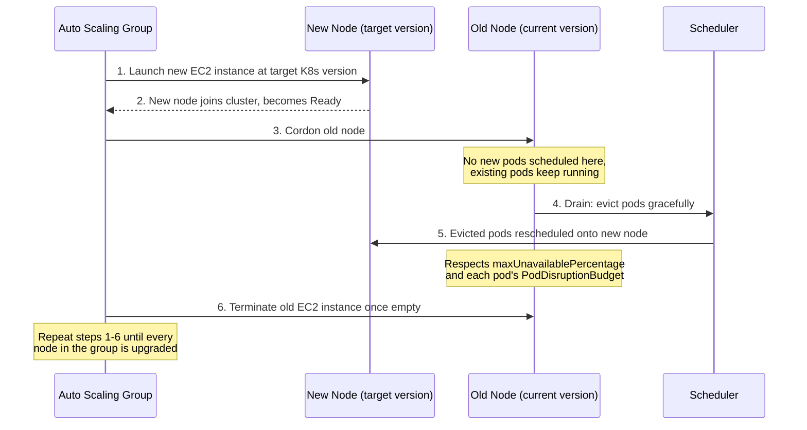

# EKS Pipelines

Two standalone GitHub Actions workflows for EKS — portable, no dependency
on any other pipeline or repo. Drop both into `.github/workflows/` of any
project that needs them.

| File | Purpose |
|---|---|
| `upgrade-eks.yml` | Two-stage approval upgrade (control plane, then node groups) |
| `eks-cluster-info.yml` | Read-only diagnostic snapshot of a cluster |

---

## Creating an EKS cluster (CLI)

Raw `aws eks create-cluster` requires you to manually stand up a VPC,
subnets, security groups, and IAM roles first — `eksctl` does all of that
in one command, which is why it's used here instead.

### Installing eksctl on Windows

The official docs link (`https://eksctl.io/installation/`) undersells how
easy it is to get this wrong on Windows — worth documenting the real path,
including the mistakes that are easy to make:

**Mistake 1: downloading the wrong CPU architecture.** GitHub releases
offer both `eksctl_Windows_amd64.zip` and `eksctl_Windows_arm64.zip`. Most
Windows PCs are AMD64 (Intel/AMD x86-64), not ARM64 — ARM64 Windows
machines are the exception (Surface Pro X and similar), not the rule.
Downloading the wrong one produces a cryptic `Exec format error` when you
try to run it, with no indication of *why* it failed.

**Check your actual architecture first**, in a plain PowerShell window
(this specific command is PowerShell syntax — it won't work in Git Bash):
```powershell
$env:PROCESSOR_ARCHITECTURE
```
Prints `AMD64` or `ARM64`. Use whichever matches for the download below.

**Mistake 2: installing into `C:\Windows\System32`.** It's tempting since
it's already on PATH, but it's a protected system directory — every future
update or removal needs admin rights, and it's not where third-party tools
belong. Use a folder under your user profile instead.

**Correct installation, in an elevated PowerShell** (Windows key → type
`PowerShell` → right-click → *Run as administrator*, needed only if you're
cleaning up a bad previous install; the actual install below doesn't
require admin rights if targeting a user folder):

```powershell
# Download the correct architecture (amd64 shown — swap to arm64 if that's what Step 1 showed)
Invoke-WebRequest -Uri "https://github.com/eksctl-io/eksctl/releases/latest/download/eksctl_Windows_amd64.zip" -OutFile "$env:USERPROFILE\Downloads\eksctl.zip"
Expand-Archive -Path "$env:USERPROFILE\Downloads\eksctl.zip" -DestinationPath "$env:USERPROFILE\eksctl" -Force

# Add to PATH permanently, user-scope (no admin rights needed for this part)
[Environment]::SetEnvironmentVariable("Path", $env:Path + ";$env:USERPROFILE\eksctl", "User")
```

**Then close PowerShell entirely and open a fresh Git Bash** —
environment variable changes don't propagate to already-open terminals.

**Verify:**
```bash
eksctl version
```
Should print a real version string, not an exec error.

**If you'd previously installed a bad copy into `System32`**, remove it
first from an elevated PowerShell (`Remove-Item C:\WINDOWS\system32\eksctl.exe`)
before the steps above — Git Bash's `rm` will fail there with a permission
error even as an otherwise-capable user, since that folder is
admin-protected regardless of which shell you use.

### Cluster creation

### Cluster creation

```bash
# Install eksctl if you don't have it: https://eksctl.io/installation/

# Check what versions are currently supported before picking one
aws eks describe-addon-versions --query 'addons[0].addonVersions[0].compatibilities[].clusterVersion' --output table 2>/dev/null \
  || echo "Check https://docs.aws.amazon.com/eks/latest/userguide/kubernetes-versions.html for the current support window"

# Create the cluster one minor version behind the latest supported,
# so the upgrade pipeline has something to upgrade to
eksctl create cluster \
  --name migration-cluster \
  --region us-east-1 \
  --version 1.34 \
  --nodegroup-name migration-ng \
  --node-type t3.medium \
  --nodes 2 \
  --managed \
  --with-oidc
```

This takes roughly 15–20 minutes (EKS control plane provisioning is slow —
don't assume it's hung if it sits quietly for a while). Confirmed working
output from an actual run:

```
2026-07-12 14:00:27 [✔]  EKS cluster "migration-cluster" in "us-east-1" region is ready

$ kubectl get nodes
NAME                             STATUS   ROLES    AGE   VERSION
ip-192-168-12-229.ec2.internal   Ready    <none>   81s   v1.34.9-eks-8f14419
```

Notes on the flags:

- **`--with-oidc`** — this sets up the **cluster's own** IAM OIDC identity
  provider, letting pods inside the cluster assume IAM roles (IRSA). This
  is a **separate concept** from the GitHub Actions OIDC federation covered
  below — don't confuse the two. It's not strictly required just to run
  these pipelines, but worth enabling up front if you'll eventually run
  workloads that need AWS permissions.
- **`--managed`** — creates a **managed node group**, which is what
  `upgrade-eks.yml`'s node group upgrade logic targets. Self-managed node
  groups (plain EC2 Auto Scaling Groups you wire up yourself) use a
  different upgrade mechanism entirely and aren't covered by this pipeline.
- **`--version`** — pick something behind AWS's current latest supported
  version (check the docs link above — EKS only supports a rolling window
  of versions, older ones get deprecated). If you create a cluster already
  on the newest supported version, the `plan` job will report
  `hasUpgrade=false` and there's nothing to exercise.

**Verify it's ready:**
```bash
aws eks describe-cluster --name migration-cluster --region us-east-1 \
  --query "cluster.{Status:status, Version:version}" --output table
```

**Delete when done testing** (EKS clusters cost money while running — the
control plane alone is billed hourly regardless of node count):
```bash
eksctl delete cluster --name migration-cluster --region us-east-1
```

---

## Why the IAM OIDC trust policy is required (detailed)

Same underlying idea as Azure's federated credentials, but AWS implements
it differently — worth understanding the actual mechanism rather than
treating the setup commands as a copy-paste incantation.

### The problem this solves

The old way to let a CI/CD pipeline authenticate to AWS was to create an
IAM user, generate an **access key + secret key pair**, and store that
pair as GitHub secrets. This has the same fundamental weakness Azure's old
service-principal-secret approach had:

- The key pair is a **long-lived, bearer credential** — anyone who obtains
  it can authenticate as that IAM identity from anywhere, indefinitely,
  until someone notices and rotates it.
- AWS has no way to verify the key pair is *actually* being presented by
  your GitHub Actions run specifically.

**OIDC federation removes the stored key pair entirely.** GitHub's Actions
runner generates a short-lived, signed token at the moment your workflow
runs, describing exactly which repo/branch/environment triggered it. AWS's
STS (Security Token Service) checks that token against an **IAM role's
trust policy**, and if it matches, issues temporary credentials scoped to
that run only — typically valid for about an hour, and useless to anyone
after the run finishes.

### How AWS's version of this differs structurally from Azure's

This is the part worth being explicit about, because if you've already set
up the Azure pipelines, the AWS model will initially look similar but work
differently in one important way:

| | Azure | AWS |
|---|---|---|
| Trust configuration unit | Many small **federated credential** objects, each trusting exactly one subject string | **One trust policy JSON** per IAM role, containing a *list* of allowed subject patterns in a single `StringLike` condition |
| Adding a new allowed subject | `az ad app federated-credential create` (a new object) | Edit the existing trust policy JSON and re-run `aws iam update-assume-role-policy` (modifying the one policy) |
| Where trust lives | On the **App Registration** (identity), shared across roles if you reuse the app | On the **IAM role** itself — each role has its own trust policy |

Practically: instead of creating a new "credential object" every time you
add a pipeline stage with a new environment name (like you did repeatedly
for Azure), on AWS you **edit one JSON file** to add another string to the
`sub` condition's list, then push the updated trust policy to the role.

### The `sub` claim — this is what actually gets checked

Identical concept to Azure's `subject` claim, same two formats:

| Trigger context | `sub` format | Example |
|---|---|---|
| A job with **no** `environment:` block | `repo:OWNER/REPO:ref:refs/heads/BRANCH` | `repo:mridulsingh8390/githubaction-pipeline:ref:refs/heads/main` |
| A job **with** an `environment:` block | `repo:OWNER/REPO:environment:ENV_NAME` | `repo:mridulsingh8390/githubaction-pipeline:environment:eks-upgrade-control-plane` |

Just like the AKS pipeline, `upgrade-eks.yml`'s `plan` and
`post-upgrade-validation` jobs have no `environment:` block (branch-based
`sub`), while `upgrade-control-plane` and `upgrade-worker-nodes` each have
their own `environment:` block (environment-based `sub`) — and the
environment name **must exactly match** between the workflow YAML and the
trust policy's allowed subject list. If you hit the AKS pipeline's
`AADSTS700213` error while setting that up, this is the same class of bug,
just surfaced differently on AWS — usually as an
`AccessDenied`/`AssumeRoleWithWebIdentity` error rather than a specific
error code.

### Full setup, structured to make future edits easy

```bash
AWS_ACCOUNT_ID=$(aws sts get-caller-identity --query Account --output text)
GITHUB_ORG="mridulsingh8390"
GITHUB_REPO="githubaction-pipeline"

# The OIDC provider is account-wide, not per-role — create once, reuse for
# every role/project in this account. Check first:
aws iam list-open-id-connect-providers --output table
# If nothing shows token.actions.githubusercontent.com, create it:
aws iam create-open-id-connect-provider \
  --url "https://token.actions.githubusercontent.com" \
  --client-id-list "sts.amazonaws.com" \
  --thumbprint-list "6938fd4d98bab03faadb97b34396831e3780aea1"

# One trust policy file, listing every subject this role should accept —
# add more strings here later instead of creating new objects
cat > eks-trust-policy.json <<EOF
{
  "Version": "2012-10-17",
  "Statement": [{
    "Effect": "Allow",
    "Principal": {"Federated": "arn:aws:iam::${AWS_ACCOUNT_ID}:oidc-provider/token.actions.githubusercontent.com"},
    "Action": "sts:AssumeRoleWithWebIdentity",
    "Condition": {
      "StringEquals": {"token.actions.githubusercontent.com:aud": "sts.amazonaws.com"},
      "StringLike": {"token.actions.githubusercontent.com:sub": [
        "repo:${GITHUB_ORG}/${GITHUB_REPO}:ref:refs/heads/main",
        "repo:${GITHUB_ORG}/${GITHUB_REPO}:environment:eks-upgrade-control-plane",
        "repo:${GITHUB_ORG}/${GITHUB_REPO}:environment:eks-upgrade-worker-nodes"
      ]}
    }
  }]
}
EOF

aws iam create-role \
  --role-name gh-eks-upgrade \
  --assume-role-policy-document file://eks-trust-policy.json \
  --description "GitHub Actions OIDC role for EKS upgrade/info pipelines"

# Confirm the ARN — this is your AWS_EKS_ROLE_ARN secret value
aws iam get-role --role-name gh-eks-upgrade --query 'Role.Arn' --output text
```

**To add another allowed subject later** (e.g. a new environment name),
edit the `StringLike` list in `eks-trust-policy.json` and push the update:
```bash
aws iam update-assume-role-policy \
  --role-name gh-eks-upgrade \
  --policy-document file://eks-trust-policy.json
```

**Quick diagnostic for next time:** if authentication fails, check what's
currently trusted:
```bash
aws iam get-role --role-name gh-eks-upgrade --query 'Role.AssumeRolePolicyDocument' --output json
```
Compare the `sub` list against the exact environment name in the failed
run's workflow file — a mismatch here is the single most common cause.

### Permissions — separate from trust

The trust policy above only controls **who can assume the role**. It
grants zero AWS permissions by itself. Attach the actual permissions
separately:

```bash
cat > eks-permissions-policy.json <<'EOF'
{
  "Version": "2012-10-17",
  "Statement": [{
    "Effect": "Allow",
    "Action": [
      "eks:DescribeCluster",
      "eks:UpdateClusterVersion",
      "eks:ListNodegroups",
      "eks:DescribeNodegroup",
      "eks:UpdateNodegroupVersion",
      "eks:UpdateNodegroupConfig",
      "eks:DescribeUpdate"
    ],
    "Resource": "*"
  }]
}
EOF

aws iam put-role-policy \
  --role-name gh-eks-upgrade \
  --policy-name eks-upgrade-permissions \
  --policy-document file://eks-permissions-policy.json
```

### The other access layer — this trips people up constantly

IAM permissions alone are **not enough** to run `kubectl` commands inside
an EKS cluster. This is different from AKS (where Azure AD RBAC covers
both control-plane API calls and in-cluster access) and different from GKE
(where Cloud IAM does the same). On EKS, you need a **second**, separate
mapping: the IAM role has to be granted Kubernetes RBAC access via the
cluster's **access entries** (or the legacy `aws-auth` ConfigMap on older
clusters):

```bash
ROLE_ARN=$(aws iam get-role --role-name gh-eks-upgrade --query 'Role.Arn' --output text)

aws eks create-access-entry \
  --cluster-name migration-cluster \
  --principal-arn "$ROLE_ARN" \
  --region us-east-1

aws eks associate-access-policy \
  --cluster-name migration-cluster \
  --principal-arn "$ROLE_ARN" \
  --region us-east-1 \
  --policy-arn arn:aws:eks::aws:cluster-access-policy/AmazonEKSClusterAdminPolicy \
  --access-scope type=cluster
```

If `aws eks describe-cluster` succeeds in your pipeline logs but `kubectl
get nodes` fails with a permissions/unauthorized error, this missing step
is almost always why.

---

## Prerequisites

### Secret (repo → Settings → Secrets and variables → Actions)

| Secret | Value |
|---|---|
| `AWS_EKS_ROLE_ARN` | IAM role ARN from the setup above |

### GitHub Environments (repo → Settings → Environments)

Only `upgrade-eks.yml` needs these — `eks-cluster-info.yml` has no approval
gate since it's read-only:

- `eks-upgrade-control-plane`
- `eks-upgrade-worker-nodes`

**The environment name here must exactly match** both the `environment:
name:` value in the workflow YAML and an entry in the trust policy's
`sub` list — see the detailed explanation above for why.

---

## `upgrade-eks.yml`

### Flow

```
plan → upgrade-control-plane (approval) → upgrade-worker-nodes (approval) → post-upgrade-validation
```

- **`plan`**: validates the cluster is `ACTIVE`, discovers current version
  and computes the next allowed target (EKS only allows one minor version
  jump per call), runs a pre-upgrade node + PDB scan before you approve
  anything.
- **`upgrade-control-plane`**: optional pre-upgrade state dump, then calls
  `update-cluster-version` and polls until the update completes.
- **`upgrade-worker-nodes`**: upgrades node groups (skipped if
  `controlPlaneOnly=true`). See below for exactly how this works.
- **`post-upgrade-validation`**: waits for nodes to be Ready, checks pod
  health, generates a markdown report uploaded as a build artifact.

### How the node group upgrade actually works

Same underlying "replace, not modify" principle as AKS, driven through
EKS's managed node group API instead of AKS's node pool API:



1. **New node launched** — `update-nodegroup-version` triggers the
   underlying Auto Scaling Group to launch new EC2 instances at the target
   version.
2. **New node ready** — joins the cluster, appears in `kubectl get nodes`.
3. **Old node cordoned** — blocked from receiving new pods.
4. **Drain begins** — pods evicted respecting PDBs. This is what the
   `plan` job's PDB scan checks for in advance.
5. **Pods reschedule** onto available capacity, typically the new node.
6. **Old instance terminated** by the ASG once fully drained.
7. **Repeat per node** — `maxUnavailablePercentage` controls how many
   nodes are mid-replacement at once. `interGroupSoakMinutes` pauses
   *between whole node groups* finishing, not between individual nodes —
   see the parity note below for why that's coarser than AKS.

### ⚠️ Feature parity with the AKS version — read before assuming equivalence

EKS's API genuinely lacks native equivalents for a few things the AKS
pipeline supports directly:

| AKS feature | EKS substitute | Why it's not the same |
|---|---|---|
| `az aks snapshot create` (real, restorable) | Pre-upgrade **state dump** (cluster + node group config as JSON, uploaded as an artifact) | Audit/rollback *reference* only — not something you can restore from. EKS has no user-triggerable control plane snapshot API; AWS manages that state directly. |
| `--node-soak-duration` (per-node wait) | `interGroupSoakMinutes` (wait **between node groups**) | Coarser — EKS's node group update API has no per-node soak parameter. |
| System vs. user pool ordering | Node groups upgraded in listing order | EKS node groups have no `mode` field distinguishing system/user like AKS does — no equivalent ordering concept to preserve. |

### Known limitation: one minor version per upgrade

EKS's API only allows upgrading exactly one minor version at a time
(e.g. 1.29→1.30, not 1.29→1.31). If `targetKubernetesVersion` is left
blank, the pipeline auto-computes current+1 minor. A bigger jump triggers
a warning and will likely be rejected by AWS.

### Inputs

| Input | Required | Default | Notes |
|---|---|---|---|
| `eksClusterName` | Yes | — | |
| `awsRegion` | No | `us-east-1` | |
| `targetKubernetesVersion` | No | blank (auto current+1 minor) | |
| `controlPlaneOnly` | No | `false` | |
| `nodeGroupName` | No | blank (all groups) | |
| `maxUnavailablePercentage` | No | `33` | |
| `interGroupSoakMinutes` | No | `5` | See parity note above |
| `createStateDump` | No | `true` | Not a restorable snapshot — see parity note above |

## `eks-cluster-info.yml`

Read-only — no mutations, no approval gate. Fetches cluster info, node
group details, and per-node version/OS/runtime info via `kubectl`.

| Input | Required | Default |
|---|---|---|
| `eksClusterName` | Yes | — |
| `awsRegion` | No | `us-east-1` |

---

## Troubleshooting

### `AssumeRoleWithWebIdentity` / access denied during OIDC login

Same root cause as Azure's `AADSTS700213` — the `sub` claim from the
failed run doesn't match anything in the trust policy's `StringLike` list.
Check with `aws iam get-role --role-name gh-eks-upgrade --query
'Role.AssumeRolePolicyDocument'` and compare against the environment name
actually used in the workflow YAML.

### `kubectl` commands fail despite AWS CLI calls succeeding

You're missing the **access entry** step — IAM trust alone doesn't grant
in-cluster RBAC access on EKS. See "The other access layer" section above.

### Node stuck cordoned with pod count not decreasing

A Pod Disruption Budget with `maxUnavailable: 0` is blocking the drain.
Check with `kubectl get pdb --all-namespaces`. The `plan` job scans for
this before you approve, but a PDB created afterward won't be caught in
advance.

### Non-healthy pods check fails immediately after printing the header

Known bug in the original version of this pipeline: `grep -v` returns
exit code 1 when it finds zero matches (i.e., when all pods are healthy),
and combined with `set -o pipefail`, that aborted the script right before
it could report success. Fixed by appending `|| true` to that line — if
your copy predates this fix, that's the symptom to look for.
